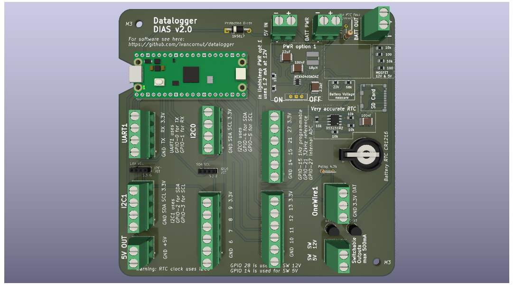
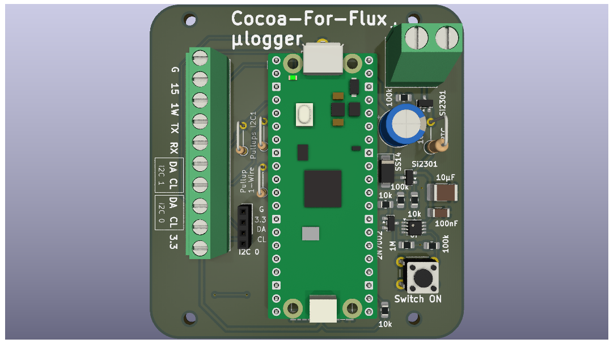
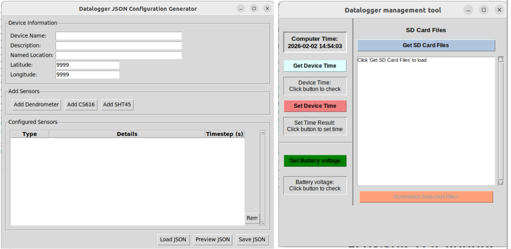

# Eco&Sols Datalogger
This is a datalogger based on a Pi Pico and to be used with a wide range of sensors. 

  * [Hardware](#hardware)
  * [Software](#software)
    + [On the computer](#on-the-computer)
    + [On the datalogger](#on-the-datalogger)

## Hardware
### Full size datalogger

We use a custome made PCB that integrates
- a low consumption and high efficiency step-down converter that can convert 6-40V down to 5V
- a low-drift RTC clock
- An SD card slot
- two controllable power outputs of 5V and 12V (or battery voltage) using MOSFETs
- reference frequency generators
- Qwiic compatible I2C and UART connectors
- A way to measure input battery voltage
### Micro sized datalogger

This is a miniaturised version of the big pcb when size is a constraint. It pushed all the power and clock circuitry beneath the Pi Pico.
It lacks some functionnality of the bigger version such as the controllable power outputs and the full shutdown circuitry. 

## Software

### On the computer

We use two GUIs on the computer:
- one that generates the json configuration file for the datalogger
- one that enables communication with the datalogger to update the clock and download files from the SD card

### On the datalogger
We use two modules. The datalogger module and the sensor module. 
